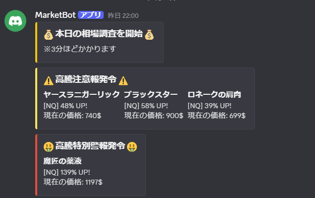

# マーケット高騰検知BOT（ベータ版）

## 概要
マーケットのアイテム価格の「現在」と「過去」の平均価格を比較し、価格が上昇しているアイテムを自動で検知・通知するBOTです。

## 仕様

- **価格調査時間**  
  毎日22時に最新24時間分のマーケットデータを取得・比較して通知します。  
  例：12月11日22時〜12月12日22時のデータを「現在」、  
　　　12月10日22時〜12月11日22時のデータを「過去」として判定。

- **通知の段階**  
  1. **高騰注意報**  
     - 現在の平均価格が過去の平均価格より30%以上上昇した場合。  
     - （閾値は設定で変更可能）  
  2. **高騰警報**  
     - 注意報の条件を満たし、かつ直近100件のデータの80%以上が過去平均価格の30%以上上回っている場合。  
     - ※販売数が100件に満たない場合はその分のみで判定。  
  3. **高騰特別警報**  
     - 警報の条件を満たし、かつ線形回帰の傾きが1以上の場合。  
     - 線形回帰の予測画像も通知に表示されます。  
     - ※価格が低いアイテムは線形回帰の精度が低くなります。

- **メンションコマンド**  
  メンションを行うと、現時刻の調査結果を即座に取得し、マーケットURLも同時に返します。  
  例： `https://universalis.app/market/45070`

- **データソース**  
  Universalisよりデータを取得しています。  
  ※ACT起動しているプレイヤーがマーケット画面を見ないと最新データが反映されません。  
  詳細 → https://www.eorzean.info/archives/34463328.html

## 設定コマンド（管理者限定）

スラッシュコマンドで設定変更可能（2024/12/12現在、管理者のみ変更可能）。

| コマンド  | 説明                                        | 初期値  |
|-----------|---------------------------------------------|---------|
| `/server` | マーケット情報取得対象サーバーの変更        | Fenrir  |
| `/money`  | 最低販売価格の設定。設定価格以下は対象外    | 0       |
| `/price`  | 高騰判定の上昇割合。例：1.5なら150%上昇で高騰判定 | 1.3     |
| `/data`   | 判定に使用する販売数の閾値。設定数以下は対象外 | 50      |
| `/past`   | 過去のデータ取得日数                          | 1       |
| `/slope`  | 線形回帰の傾き閾値                            | 1       |

## 注意事項

- 最新データとは限らないため、参考情報としてご利用ください。  
- マーケットの更新はACT利用者の閲覧状況に依存しています。

## 通知例



## 使用例

メンションでBOTに呼びかけると、リアルタイム調査とURLが返されます。

```plaintext
@MarketBot
